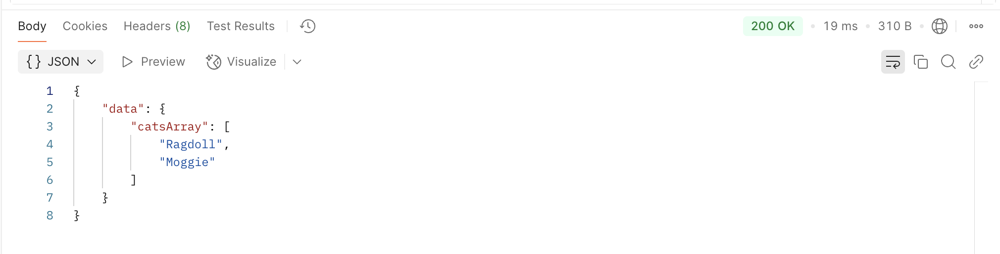

## Creating Full Stack Web Applications with JavaScript

When JavaScript was created, it used to **strictly run on the browser**, and was used to **add dynamic effects on web pages**. Now, we can use JavaScript as a **full-stack language**, meaning that it's a tool to **build both the front and back-end of web applications**. So far, you have been using **the Node.js environment** to run your code, which is **the environment used to run back-end JavaScript code**. Next week, you will see how to run JavaScript in your browser - for now, we will have a look at a **Express**, a common JavaScript back-end framework and learn how to build a very simple server with it. 


Learning objectives: 
- Learn how a basic Express server is built
- Learn about JSON data
- Write a simple Express route and check it works using Postman

Key concepts: 
- routes or endpoints
- HTTP requests and responses
- JSON data

## What is Express?

This section will be building on knowledge from the Web Applications week, especially routes and HTTP requests/responses.

<details>
<summary> I need a refresher </summary>
<br>
You can think of routes/endpoints as the address where data lives on a server. For instance, if you are using a server with an endpoint `/users`, we can deduce that all the data related to users will be accessible through that endpoint.

HTTP requests are a way to go and "knock on the door" of the adress where the data lives. For example, if I want to do something with the data located at the address `/users`, I will need to send a request to that route. 

HTTTP methods are the ways in which you are allowed to interact with that data. For example, the users data might live at the `/users` endpoint, but that doesn't mean you can interact with that data willy-nilly. For instance, the `/users` route
might accept requests with a GET method, but not a POST or PUT one. This depends on how the server is configured. 

Responses are what the server sends back to answer your initial request. If an endpoint is set-up to accept GET requests, and you send the correct HTTP request with a GET method, then it will send back a response with the relevant data. If something in your request is wrong, or not configured on the server, you will get an HTTP error. 

To build on example above, the `/users` endpoint on my server could be configured like so:

| Endpoint    | Method   | Response Data   |
| ------------| ---------|-----------------|
| /users      | GET      | All users data  |

What would happen if we sent an HTTP request with a DELETE method? Or if we sent a request to `/user` by mistake? Have a think! 
</details>
<br>

**Express is like Flask for JavaScript** - it lets you **create a web server**, set-up some routes and set what HTTP requests they accept and what responses they send back to the client. 


Unlike Flask, **Express doesn't respond with an HTML template**. Instead, **it responds with a specific data type called JSON**. JSON stands for JavaScript Object Notation, and is simply a way of writing a JavaScript object as a string.

For example: 

```
//Regular JavaScript object: 
const cat = { colour: "calico", name: "Fudge", age: 4 };

//Same object in JSON format: 
"cat" = { "colour": "calico", "name": "Fudge", "age": "4" };

```

You'll notice that both the keys and values become strings, including the number 4. 

Next week, we will see how to connect this kind of back-end with a front-end, since we are no longer responding with HTML templates. For now, we will focus on building a simple Express server.

## Building a simple Express server:

In this video, you will learn about the basic syntax of an Express server. We will be writing the following endpoint to our Express server: 

| Endpoint    | Method   | Response Data   |
| ------------| ---------|-----------------|
| /cats       | GET      | Cat data        |


VIDEO HERE


Here are the basic blocks of our server:

```
// Requires relevant modules from your node_modules - don't forget to install the necessary packages!
const express = require("express");
const cors = require("cors"); 

const app = express(); // Creates an Express application

app.use(cors()); //allows cross-origin requests

const port = 3000; //sets port where your server should run

app.listen(port, () => {
    console.log("Now listening on port", port);
}); // function that will run when you start your server
```

And here is a breakdown of the syntax of the endpoint built in the video above:

```
//Entire function: 

app.get("/cats", (req, res) => {
  const data = { catsArray: ["Ragdoll", "Moggie"] } 

  res.send(data);
});

--------------------

app.get(endpoint, callback) 

/* 
app.get() is a function that takes two arguments, the endpoint url and the callback function to be called when an HTTP request with a GET method is sent to that endpoint. 
*/

--------------------

(req, res) => {
    //code goes here
};

/* 
Callback function that will execute when the user sends a GET request to the "cats" endpoint. It has two parameters: 
- req: the request object sent to the server.
- res: the response object the server will send back.
*/

--------------------

res.send(data);
/*
The response object has a method `send` that we use here to send a response back to the client with the relevant data. 
*/

```

Whe we hit that enpoint with Postman, here is what we see: 



This is our JavaScript object sent back as a part of our response, converted into JSON by Express. 

## Challenge: 

Here's a link to some boilerplate Express code - clone the repo and run the following to get started: 

```
npm install
```

Create the following endpoints on this server: 


| Endpoint    | Method   | Response Data   |
| ------------| ---------|----------------------------------------------------|
| /cities     | GET      |  {"cityList": ["Nairobi", "Tokyo", "Helsinki", "Berlin"]}|
| /countries  | GET      | {"countriesList": [{ "country": "France", "language": "French", "id": "1" }, {"country": "Spain", "language": "Spain", "id": 2}]} |

Test them using Postman, and make sure they return the data specified in the table above. 

## Extension Challenge: 
If you feel confident with the content above, you can try to tackle this challenge! 

Look for the Route Parameters [section in the Express docs](https://expressjs.com/en/guide/routing.html), and try to figure out how to implement this modified `/countries` endpoint. 

**Hint:** *It should be separate from the simple `/countries` endpoint implement in the previous exercise.*

| Endpoint    | Method   | Response Data   |
|-------------|----------|-----------------|
| /countries/:id  | GET      | should respond with the country with the corresponding id  |

Your endpoint should use the following data:

```
const countriesList = [
        { country: "France", language: "French", id: "1" }, 
        { country: "Spain", language: "Spain", id: 2}
    ]
```

And pick the relevant country to respond with based on the :id in the route parameters. 

<details>
<summary>Help me get started</summary>
<br>

```
app.get("/countries/:id", (req, res) => {
    //Pick the relevant country in this array based on the id:
    const countriesList = [
        { country: "France", language: "French", id: "1" }, 
        {country: "Spain", language: "Spain", id: 2}
        ]
})
```

</details>
